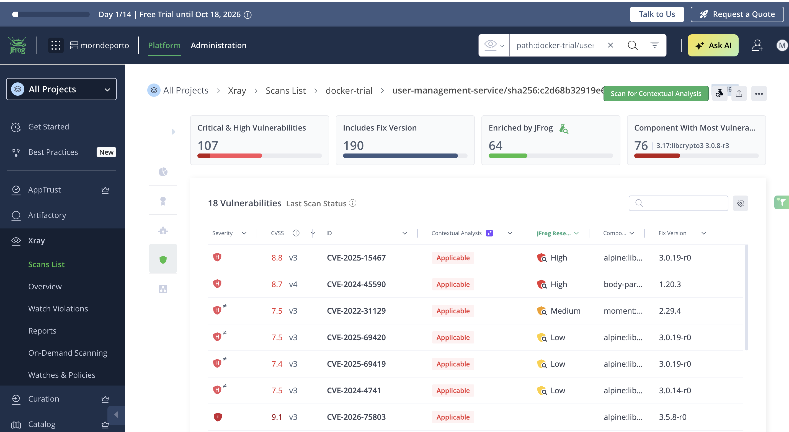
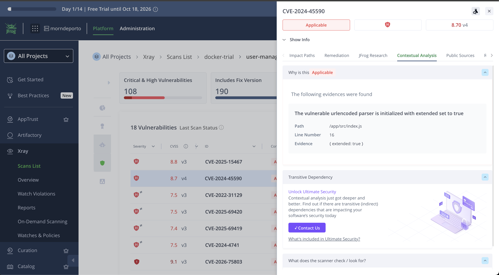
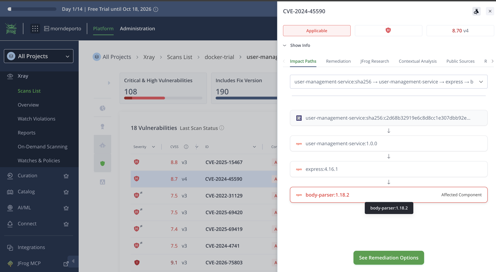
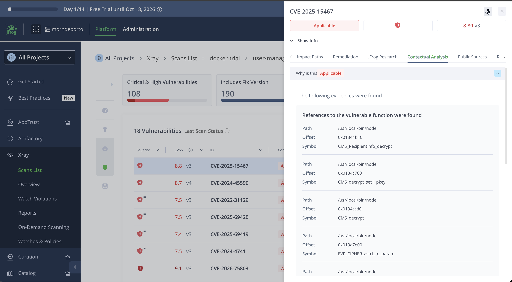
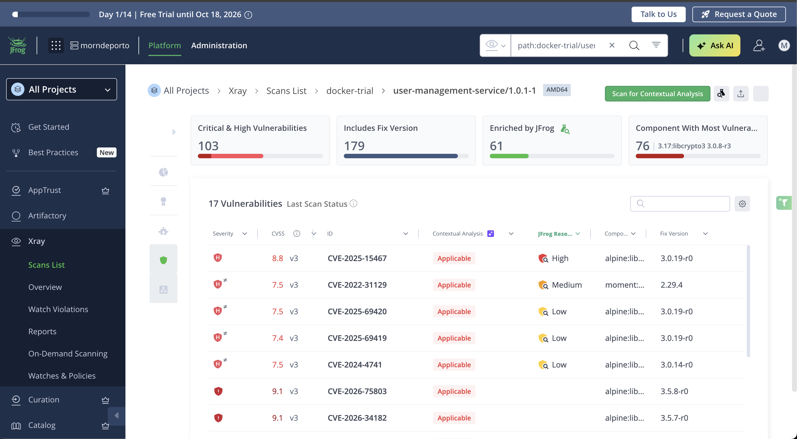
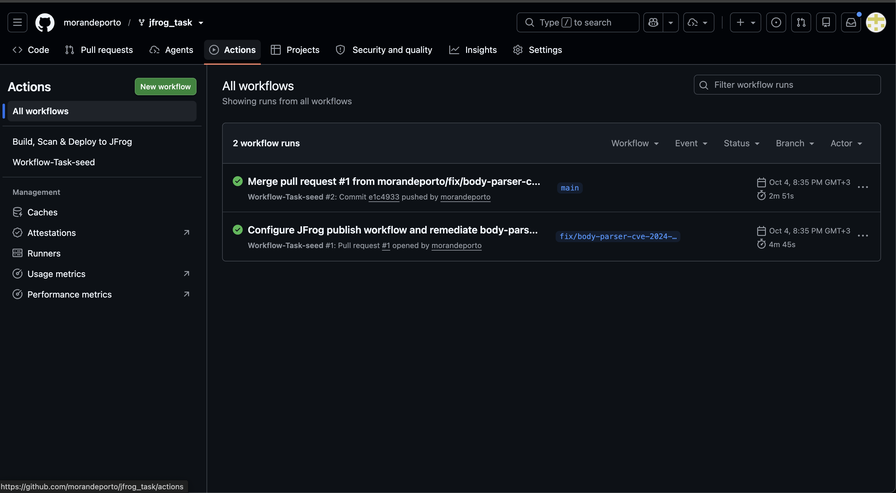
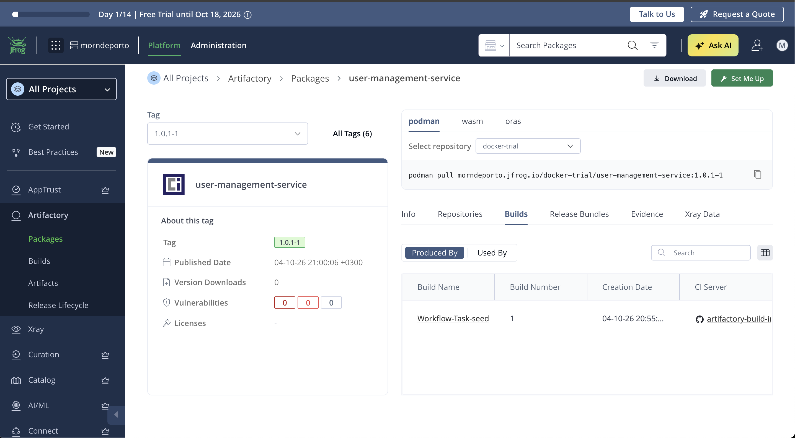
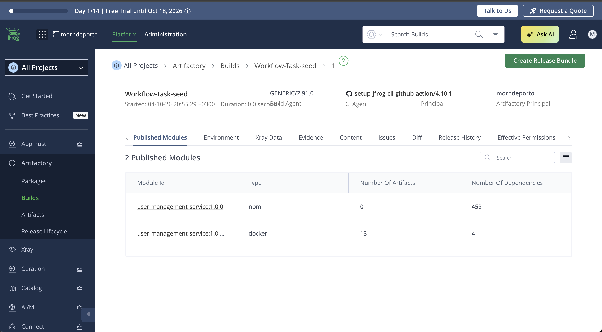

# Stage 2 — JFrog Xray scan, remediation, and CI publish

Written in the first person — this is my account of the work.

**Fork:** [morandeporto/jfrog_task](https://github.com/morandeporto/jfrog_task)  
**Fix branch:** `fix/body-parser-cve-2024-45590`  
**JFrog trial environment:** `morndeporto.jfrog.io`

---

## 1. Scan and the two applicable vulnerabilities (task step 2a)

I used two scans:

| Scan | How | Notes |
|------|-----|--------|
| Source level | `jf audit` (JFrog CLI 2.124.0) | Run on the original code (express 4.16.1), before the express upgrade. Full output: [jf-audit-before.txt](jf-audit-before.txt). |
| Image level | Original code built as a Docker image, pushed to `docker-trial`, scanned with Xray **Contextual Analysis** | UI evidence in the screenshots below. |

### Two High findings (JFrog Research) from the image scan

| CVE | CVSS | Component | Why applicable | Fixed in |
|-----|------|-----------|----------------|----------|
| CVE-2024-45590 | 8.7 (v4) | body-parser 1.18.2 via express 4.16.1 | URL-encoded parser initialized with `{ extended: true }` in `/app/src/index.js` line 16 | body-parser 1.20.3 |
| CVE-2025-15467 | 8.8 (v3) | libcrypto3 3.0.8-r3 (Alpine base) | References to vulnerable OpenSSL functions (`CMS_decrypt`, `PKCS7_decrypt`, …) found in `/usr/local/bin/node` | libcrypto3 3.0.19-r0 |

### Notes

- The view listed 18 findings before the fix, all Applicable.
- `jf audit` marked CVE-2024-45590 **Not Applicable** while the image scan marked it **Applicable**. I did not investigate why.
- The vulnerability database updates continuously, so a scan on another date may differ slightly.

---

## 2. What "applicable" (contextual analysis) means and why it changes prioritization (step 2b)

Contextual analysis answers a different question from a normal scan. A normal scan asks: does a package version I use have a known vulnerability? Contextual analysis asks: does my software actually reach it? For an npm package, the scanner looks for the specific condition that makes the vulnerability possible. In my project, CVE-2024-45590 needs the URL-encoded parser to be set with `extended: true`, and my code does exactly that (`src/index.js`, line 16), so it is Applicable. For the Alpine base image, the scanner found references to the vulnerable OpenSSL functions inside the Node binary.

This changes prioritization because a raw list is sorted by severity only, and many of those vulnerabilities cannot happen in my app. For example, in the `jf audit` results lodash CVE-2019-10744 is rated Critical but Not Applicable, while CVE-2018-16487 is only Medium but Applicable. If I followed the raw list, I would fix the Critical one first and waste time. With contextual analysis I fix first what my code can really trigger.

It is not a guarantee: Applicable means the vulnerable code or condition is present and reachable by the analysis, not that someone has exploited it, and Not Applicable does not mean safe.

---

## 3. The remediation I chose (step 2c)

### Chosen fix

- **CVE-2024-45590**, fixed by upgrading express `4.16.1` → `4.22.3` (exact version, one-line change in `package.json`).
- Verified with `npm ls body-parser`: `express@4.22.3` → `body-parser@1.20.8`.

### Why this path

It is an npm dependency, so the fix lives in the app. One root upgrade pulls in a fixed body-parser.

### Alternatives considered

| Alternative | Outcome |
|-------------|---------|
| npm `overrides` for body-parser | Not supported: the image uses `node:14-alpine` with npm 6.14.18 (`docker run node:14-alpine npm -v`). |
| Set `extended: false` in code | Removes the applicable condition but changes URL-encoded parsing and leaves the library vulnerable; defense in depth only. |
| Fix CVE-2025-15467 instead | Comes from the Alpine base image; fixing it means changing the base image — a larger change outside the chosen scope. |

### Verification

- 9 of 9 local tests pass. To run them I had to install `bcrypt` and `validator` locally with `--no-save` because the code imports them but they are missing from `package.json`.
- Rescan of the fixed image `1.0.1-1` (amd64): CVE-2024-45590 no longer appears; the list went from 18 to 17 findings; CVE-2025-15467 remains as expected.
- Caveat: the "before" image was built on a Mac (arm64) and the fixed one in CI (amd64), so OS-package counts are not strictly comparable; the npm-level result is not affected.
- I compared the lists and no new CVE appeared after the upgrade.

### Commits

| Change | Short hash | Message |
|--------|------------|---------|
| Express upgrade | `1961b69` | Upgrade express to 4.22.3 to remediate CVE-2024-45590 (body-parser) |
| Workflow configuration | `1148750` | Configure publish-build workflow for JFrog Docker and npm. |
| Merge to main | `e1c4933` | Merge pull request #1 from morandeporto/fix/body-parser-cve-2024-45590 |

---

## 4. Build, tag, push and Build Info (steps 2d and 2e)

### Workflow

[`.github/workflows/publish-build.yml`](../../.github/workflows/publish-build.yml) runs on pull requests and on `main`. It authenticates to JFrog with OIDC, builds the Docker image, pushes it to Artifactory, and publishes Build Info.

### Changes from the starter workflow

Compared to the starter `publish-build.yml` (commit `10fac97`):

| Change | Reason |
|--------|--------|
| `DOCKER_REPO`: `docker-trial` | Replaced the placeholder with the Local Docker repository name. |
| `IMAGE_NAME`: `user-management-service` | Docker image names must be lowercase (`myApp` is invalid). |
| `jf npm install` instead of `jf npm ci` | `package-lock.json` is not tracked (ignored via `.gitignore`). |
| `platforms: linux/amd64` only | arm64 needs QEMU, which is not configured in this workflow. |
| Tag `1.0.1-${{ github.run_number }}` in the build step and in `metadata.json` | Build Info must reference the same tag and digest. |

Also present in the diff (not required for the task narrative): workflow `name` changed from `devrel` to `Workflow-Task-seed`; minor OIDC comment wording. The `env.NPM_VIRTUAL_REPO` placeholder in the YAML file was left as-is; the steps resolve the repo via the GitHub Actions variable `vars.NPM_VIRTUAL_REPO`.

### Setup

- Repositories: `docker-trial` (Local Docker), `npm-virtual` (created, with an npm remote behind it), `artifactory-build-info`.
- GitHub repository variables: `JF_URL` (host only, no `https://`) and `NPM_VIRTUAL_REPO`.
- OIDC integration: `jfrog-github-oidc` with an identity mapping on repository `morandeporto/jfrog_task`.
- The repository belongs to a personal account, not a GitHub organization, so JFrog rejected the organization check and I enabled the permissive configuration.
- Token scope: Admin because this is a throwaway trial; in production use a GitHub organization, least privilege, and no permissive mode.

### Result

- Green on the pull request and on `main`.
- Build `Workflow-Task-seed`, number 1, published by the JFrog CLI GitHub action, with two modules: the npm module `user-management-service:1.0.0` (459 dependencies) and the Docker module (13 artifacts, 4 dependencies) for the image `user-management-service:1.0.1-1` in `docker-trial`.

---

## 5. Problems I ran into

- Manifest list plus attestation entry from a default Docker Desktop build (the attestation shows as a separate Xray artifact with 0 findings; open the platform entry).
- OIDC "Invalid organization" with a personal repo.
- Empty `JF_URL` variable causing `https:///...` errors.
- Repository name must match `NPM_VIRTUAL_REPO` exactly.
- The first `jf npm install` through Artifactory is slow because it fills the remote cache.

---

## 6. Findings outside the task scope (noted, not fixed)

- Hard-coded JWT secret in `src/index.js` line 12 (value not shown).
- `jf audit` SAST: tainted field access in `src/routes/users.js` line 143, and no security middleware.
- `bcrypt` and `validator` are imported in source but missing from `package.json` (app fails to start and tests fail on a clean install).
- `node:14-alpine` is an end-of-life Node version; `npm install` in the image also installs devDependencies.

---

## 7. What I would do next

- Maintained base image with a multi-stage build and `npm ci --omit=dev`.
- Fix missing dependencies and the hard-coded JWT secret.
- Xray policy and Watch on `docker-trial` so applicable High findings fail the build.
- Least-privilege OIDC with a real GitHub organization.
